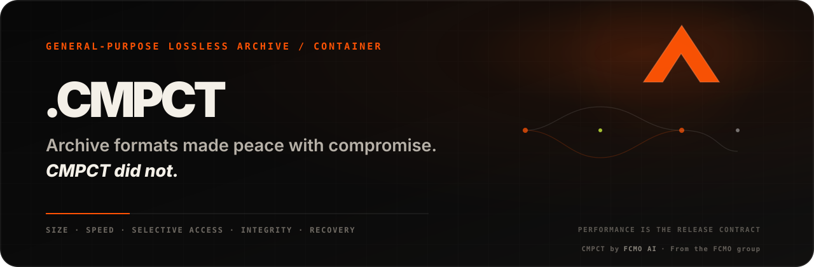

<div align="center">
  <a href="https://fcmo-ai.github.io/.CMPCT/?lang=id"></a>

  **Proyek arsip/kontainer lossless serbaguna yang dirancang untuk mendorong byte tersimpan, akses selektif, integritas, pemulihan, dan portabilitas secara bersamaan.**

  **[Situs](https://fcmo-ai.github.io/.CMPCT/?lang=id)** · **[Lab Browser](https://fcmo-ai.github.io/.CMPCT/?lang=id#lab)** · **[Benchmark](../BENCHMARKS.md)** · **[Format](../FORMAT.md)** · **[Roadmap](../ROADMAP.md)** · **[Titik masuk agen](../CURRENT_STATE.md)**

  <sub>core v0.29.0 · format kanonik r24 · surface 0.29.k · pre-1.0</sub>
</div>

> **Terjemahan terkurasi.** Ini adalah adaptasi semantik yang dicatat di version control dari README untuk manusia. [`README.md`](../../README.md) berbahasa Inggris tetap menjadi otoritas kanonik. Angka, path, nama format, dan batas bukti dipertahankan dengan sengaja. Dokumen ini tidak diberi label “ditinjau manusia bilingual” sebelum peninjauan tersebut benar-benar terjadi.

---

> **Performa adalah kontrak rilis.** Riset boleh menemukan trade-off yang tidak nyaman. Rilis yang dipromosikan tidak boleh menyembunyikannya: regresi deterministik ukuran arsip memiliki **toleransi 0 byte**, perlambatan terkonfirmasi di luar batas noise runner yang sama memblokir promosi, dan workload yang kalah tetap menjadi bukti publik.

## Mengapa CMPCT ada

| | CMPCT ingin memperbaiki |
|---|---|
| **Byte tersimpan** | Identitas eksak, representasi sadar-konten, dan reuse relasi terbatas alih-alih menganggap setiap file sebagai aliran byte terpisah. |
| **Akses selektif** | Membaca objek atau rentang yang diminta tanpa dekompresi wajib seluruh arsip. |
| **Integritas + pemulihan** | Check, metadata redundan, dan jalur salvage sebagai perilaku reader nyata, bukan prosa disaster recovery. |
| **Fidelitas filesystem** | Mempertahankan link, sparse files, metadata, dan semantik update modern. |
| **Interoperabilitas** | Memisahkan kontrak kanonik reader/writer, export ZIP, native core, dan portability gates dari grammar eksperimental. |
| **Kualitas bukti** | Klaim publik dari record reproducible yang committed, kekalahan tetap terlihat, dan menolak benchmark theater. |

CMPCT bukan “Zstd dengan ekstensi baru” dan tidak puas menang di satu folder pilihan. Targetnya adalah arsip default yang lebih kuat pada **ukuran, kecepatan, random access, fidelitas, integritas, pemulihan, update, dan semantik storage modern**, tanpa diam-diam memindahkan biaya ke tempat lain.

## Frontier terverifikasi terbaru

**Project v0.29.0 — Mosaic / Residual Program Packing** memajukan engine riset terverifikasi sementara format kanonik yang dikirim tetap **revision 24**.

| Bukti riset v0.29 | Hasil |
|---|---:|
| Portable inherited-frontier portfolio | **137,501,815 B** |
| Direct v0.28 base | 137,550,416 B |
| Penghematan eksak | **48,601 B (0.035333%)** |
| Portable workloads | **15** |
| Membaik / regresi | **2 / 0** |
| Exact v0.28 fallbacks | **13 / 15** |
| Hostile mechanism suites | **4.407362% lebih kecil**, 9 membaik / 0 regresi di 18 workload |
| Fixed hostile scheduler | **182.454 s → 97.944 s median (-46.318%)**, arsip terpilih byte-identical |

Pada agregat deterministik resemblance-hostile 724 file / 93,526,384 byte, percobaan #5 yang diterima menyimpan **47,147,764 B**. Pada tree yang sama: ZPAQ m5 47,062,639 B, solid tar+Zstd-19 47,065,652 B, 7z/LZMA2 47,430,343 B, Borg 76,461,311 B, ZIP/Deflate-9 76,690,799 B.

Ini adalah **perbandingan berpasangan byte tersimpan, bukan klaim paritas semantik**. Solid archive, backup repository, dan CMPCT punya trade-off berbeda. Record permanen: [`docs/releases/v0.29.0.md`](../releases/v0.29.0.md); evidence machine-readable: [`benchmarks/history/`](../../benchmarks/history/).

### Shipping vs frontier

| Otoritas | Status | Arti |
|---|---|---|
| **Reader/writer kanonik** | **r24** | Yang ditulis `python -m cmpct create` dan harus dipahami reader kanonik. |
| **Frontier riset** | **CMPNX11 / v0.29.0** | Mosaic + Residual Program Packing eksperimental; bukan sintaks r24. |
| **Surface publik** | **0.29.k** | Presentasi repo/site/docs tanpa otoritas atas semantik arsip. |
| **Lisensi** | **Apache-2.0 diusulkan** | Hanya proposal, belum grant publik final. |

## Apa yang bisa dilakukan CMPCT hari ini

Prototype kanonik r24 mencakup content-addressed deduplication, adaptive Zstandard/raw storage, Zstd dictionaries dan micro-solid packs, content-defined chunking, byte-range reads cepat dan parallel decode, hardlink/symlink/sparse preservation, UID/GID/xattrs, ZIP/WHL virtualization, lossless PCM-WAV saat menang, raw Deflate reuse untuk ZIP export, CRC32 + SHA-256, redundant head/tail indexes, self-describing blob records, transaction append journal, on-demand ZIP export, serta optional reproducible/deterministic parallel creation.

v0.29 juga mengeksplorasi bounded FastCDC units, multi-band similarity search, depth-1 COPY/LITERAL deltas, multi-root Mosaic placement, Residual Program Packing, exact v0.28 fallback, locality/resource ceilings, exact DEFLATE lewat pinned memory-safe bridge, Merkle-authenticated records, authenticated tail recovery, strict remote range sources, dan byte-identical parallel scheduling.

Mekanisme riset tetap di luar reader kanonik sampai lulus secara independen format integration, conformance, hardening, native parity, recovery, dan portability.

Aturan: **pemilihan berdasarkan konten, bukan folklor berdasarkan ekstensi**.

## Mulai cepat

```bash
python -m pip install -e .
python -m cmpct create ./folder archive.cmpct
python -m cmpct create ./folder reproducible.cmpct --reproducible
python -m cmpct create ./large-folder parallel.cmpct --workers 8
python -m cmpct info archive.cmpct
python -m cmpct list archive.cmpct
python -m cmpct verify archive.cmpct
python -m cmpct extract archive.cmpct ./restored
python -m cmpct range archive.cmpct path/to/huge.bin 1048576 4096 -o slice.bin
python -m cmpct export-zip archive.cmpct legacy.zip
```

Fresh-process CLI sengaja serial tanpa `--workers N`. Gate v0.28 menemukan ~10 ms thread-pool startup pada tree media kecil; in-process `Builder` mempertahankan deterministic parallel creation sebagai default.

Optional native Linux chunker:

```bash
cc -O3 -shared -fPIC native/cmpct_cdc.c -o src/cmpct/libcmpct_cdc.so
```

Reader **tidak bergantung** pada helper ini; batas chunk dicatat eksplisit di disk.

## Posisi performa

- **ukuran:** input identik + encoder semantics tidak boleh menghasilkan arsip lebih besar; toleransi **0 byte**;
- **create/extract:** base dan candidate pada runner yang sama, median berulang; slowdown terkonfirmasi di luar noise envelope memblokir release;
- **evidence:** setiap numeric core release commit record benchmark publik baru;
- **corpora:** workload kalah/adversarial tetap terlihat.

Lihat [`docs/PERFORMANCE_RELEASE_GATE.md`](../PERFORMANCE_RELEASE_GATE.md) dan [`docs/BREAKTHROUGH_REHABILITATION.md`](../BREAKTHROUGH_REHABILITATION.md).

## Urutan baca agen baru

`docs/AGI_ENGINEERING_STANDARD.md` → `README.md` → `AGENTS.md` → `docs/CURRENT_STATE.md` → `docs/releases/` terbaru → `docs/PERFORMANCE_RELEASE_GATE.md` → `docs/BREAKTHROUGH_REHABILITATION.md` → `docs/FORMAT.md` → `docs/HISTORY.md` → dokumen EntropyGraph/Mosaic → `docs/HARDENING.md` → `docs/PORTABILITY.md` + `docs/NATIVE_CORE.md` → `docs/RESEARCH_LOG.md` → `docs/BENCHMARKS.md` + `benchmarks/history/` → `docs/PUBLIC_SURFACE.md` → `docs/ROADMAP.md`.

Agen baru tidak seharusnya membutuhkan chat privat, corpora privat, atau konteks proyek lain.

## Peta repository

`src/cmpct/` = referensi kanonik r24; `experiments/` = jalur riset; `benchmarks/` = corpora/gates deterministik + `benchmarks/history/`; `fuzz/` = serangan parser/resource; `tools/check_*` = contract checks; `site/` = site + Browser Lab; `native/` = accelerator/shared core; `docs/` = kontrak/kampanye/sejarah/roadmap; `tests/` = regression format, round-trip, similarity, locality, reproducibility.

## Situs

Situs dirancang untuk **menciptakan dampak dulu, membuktikan klaim kemudian, baru mendapatkan kepercayaan**. Angka, pesaing, workload, kekalahan, dan status core berasal dari benchmark history yang versioned. **Frontier riset**, **paritas kanonik**, dan **surface revision** dipisahkan tegas. Agresif secara visual boleh; kemenangan palsu tidak.

**Buka:** https://fcmo-ai.github.io/.CMPCT/?lang=id

## Disiplin versi

1. **Numeric core (`MAJOR.MINOR.PATCH`)** — hanya untuk kemajuan material produk; setelah v0.27.1, progres normal menggerakkan `MAJOR.MINOR`, `PATCH=0` untuk packaging compatibility.
2. **Surface (`MAJOR.MINOR.LETTER`)** — site/docs/repo/workflow; sekarang **`0.29.k`**.
3. **On-disk revision** — hanya saat reader memerlukan grammar/semantik baru; kanonik **r24**.

CI menjaga ketiga sumbu terpisah dan menolak bump yang tidak didukung evidence.

## Sejarah, provenance, dan surface publik

CMPCT berkembang dari eksperimen Seekable-Zstd, indexed-Zstd, adaptive-framing, dan ZIP-family. Sejarah teknis dipertahankan; identitas corpora privat, artefak privat, dan unrelated provenance tidak. Benchmark publik harus reproducible atau memakai input publik/sintetik dengan sengaja; hasil historis **bukan jaminan performa universal**.

CMPCT harus berdiri sendiri. Repo/site tidak boleh membutuhkan atau mengekspos proyek internal yang tidak terkait, data pelanggan privat, corpora privat, informasi pribadi, transkrip chat, credentials, nama artefak privat, atau link internal. Lihat `docs/PUBLIC_SURFACE.md`.

## Kanonisitas

Repository ini menggantikan prototype dan benchmark script chat-local. Kemajuan material engine/archive mendapat numeric release; site/docs/presentation memakai `SURFACE_REVISION`; riset tetap eksplisit eksperimental sampai promotion. Kode eksperimen tidak boleh mengklaim dukungan kanonik tanpa integrasi ke reference reader/writer dan conformance.

## Lisensi

Apache License 2.0 adalah **lisensi yang saat ini diusulkan**, belum final. Teks: `LICENSE-APACHE-2.0-PROPOSED.txt`; adoption checklist: `LICENSING.md`. Sampai proses selesai, CMPCT tidak boleh direpresentasikan sebagai sudah final dirilis di bawah Apache-2.0.
